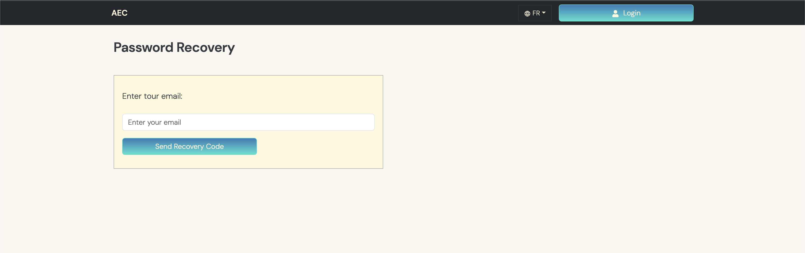
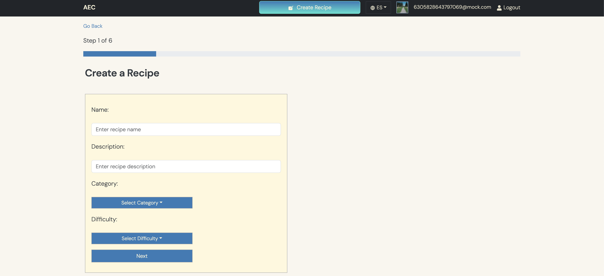
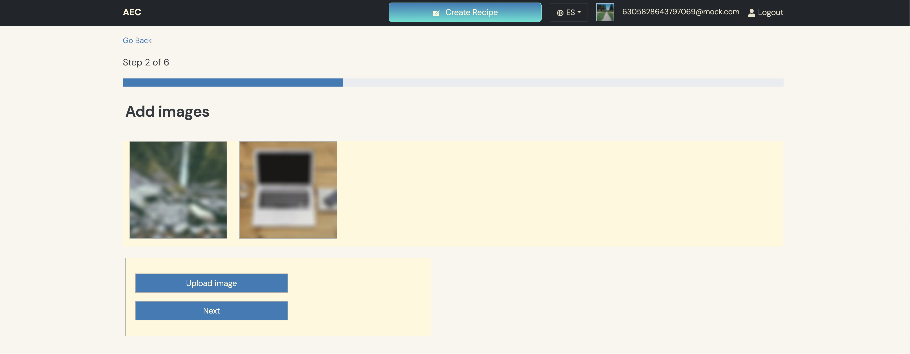
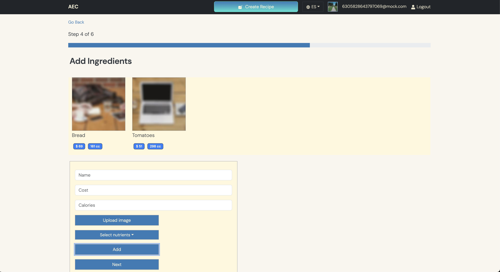

# React App


## Development 
```bash
nvm use 20.5.0
pnpm i
npx eslint --fix src/**/*.tsx src/*.tsx
pnpm run-script start
```

## Deployment

```bash
nvm use 20.5.0
pnpm i
pnpm run-script build
s3 sync <s3://aet.martincastroalvarez.com>
```











